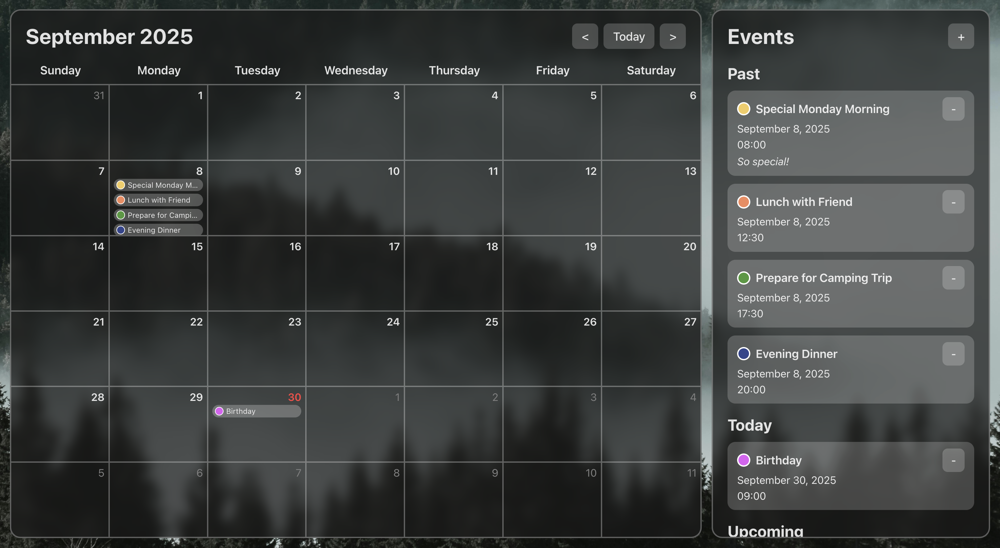

# Calendar

## Motivation
The motivation behind creating this Calendar project was to practice React and web development concepts, such as:
- React Components
- React State Management
- JSX Syntax
- Javascript Dates
- Modals
- Input Validation

## Features
Features of this Calendar project include:
- Calendar UI
- Today's Date Highlighted
- Event Creation & Deletion
- Chronological List of Events
- Daily Minimalistic List of Events

## Instructions
### Calendar
To view past or upcoming months, click the `<` and `>` buttons near the top-right corner of the calendar. To return to the month containing today's date, click the `Today` button.

### Events
To add a new event, click the `+` button in the top-right corner of the Events List. Then, fill out the fields in the modal with the event details:
- `Event Name` is a required field
- `Date` is a required field
- Event colour can be change by clicking the colour-filled circle
- `Notes` is an optional field
Click `Add` to add the event to the calendar. Click `Cancel` to clear the fields and return to the calendar.

To delete an existing event, click the `-` button near the top-right corner of the event card in the Events List.

## Improvements
One improvement for this project would be using HTML Form Validation features in the event modal, such as the `required` attribute.